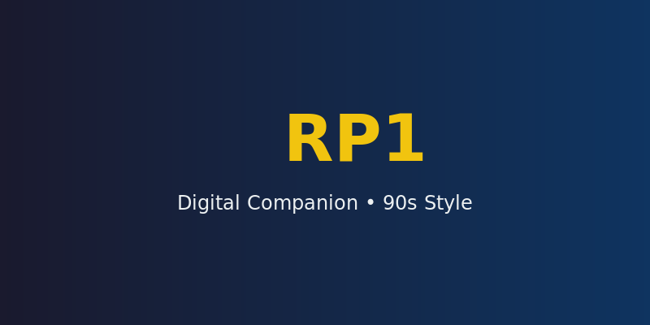

# 🤖 RP1 - Digital Companion

<p align="center">
  
</p>

<p align="center">
  
  
  
</p>

> **RP1** es un compañero digital estilo años 90. ¡Como un Tamagotchi parlante o una PC con Windows 95 con personalidad!

---

## ✨ Características

| Feature | Description |
|---------|-------------|
| 🎨 **Colores Personalizables** | Amarillo, Rojo, Azul, Verde, Rosa, Cian |
| 🌐 **Bilingüe** | Español e Inglés |
| 🔊 **Voz TTS** | Text-to-speech con pyttsx3 |
| 💾 **Configuración Persistente** | Se guarda en `~/.rp1/config.json` |
| 🤖 **IA Local** | Usa Ollama con gemma3:4b |
| 🖥️ **Multiplataforma** | Linux, Mac, Windows |

---

## 🚀 Instalación

### Linux / macOS

```bash
git clone https://github.com/Samuv5/rp1.git
cd rp1
chmod +x install.sh
./install.sh
```

### Windows

```batch
git clone https://github.com/Samuv5/rp1.git
cd rp1
install.bat
```

### 📦 Descarga Directa

Descarga el AppImage desde [Releases](https://github.com/Samuv5/rp1/releases):

```bash
chmod +x RP1.AppImage
./RP1.AppImage
```

---

## 📖 Uso

```bash
rp1
```

### Opciones de Inicio

| Comando | Descripción |
|---------|-------------|
| `rp1 --voice` | Iniciar con voz activada |
| `rp1 --setup` | Descargar modelo gemma3:4b manualmente |

### Comandos Internos

| Comando | Descripción |
|---------|-------------|
| `help` 📋 | Mostrar comandos disponibles |
| `voice` 🔊 | Activar/desactivar voz |
| `color` 🎨 | Cambiar color del robot |
| `lang` 🌐 | Cambiar idioma (es/en) |
| `config` ⚙️ | Ver configuración actual |
| `reload` 🔄 | Recargar con nueva configuración |
| `exit` 🚪 | Salir de RP1 |

---

## 🎮 Colores Disponibles

```
┌─────────────────────────────────────┐
│  🟡 Yellow   🔴 Red    🔵 Blue     │
│  🟢 Green    🩷 Pink   🔵 Cyan     │
└─────────────────────────────────────┘
```

---

## 🌐 Idiomas

| Código | Idioma |
|--------|--------|
| `es` | Español 🇲🇽 🇪🇸 |
| `en` | English 🇺🇸 🇬🇧 |

---

## 📁 Estructura del Proyecto

```
RP1/
├── src/
│   └── rp1.py          # Código fuente
├── install.sh          # Instalador Linux/Mac
├── install.bat         # Instalador Windows
├── RP1.AppImage        # AppImage portable
├── README.md           # Documentación
├── LICENSE             # GPL-3.0
└── requirements.txt    # Dependencias Python
```

---

## ⚙️ Configuración

La configuración se guarda en `~/.rp1/config.json`:

```json
{
  "color": "yellow",
  "language": "es"
}
```

---

## 📋 Requisitos

- 🐍 Python 3.8+
- 🤖 Ollama
- 📦 Modelo gemma3:4b
- 🔊 pyttsx3 (para voz)

---

## 📸 Screenshots

<details>
<summary>Haz clic para ver screenshots</summary>

### Banner de Inicio
```
=========================================
  🤖 RP1 - Digital Companion
=========================================
[system] modelo: gemma3:4b
[system] voz: desactivada
[system] color: Yellow
[system] idioma: Español

rp1: soy rp1, un companero digital antiguo...
```

### Cambiando Color
```
color > cyan

=========================================
  🤖 RP1 - Digital Companion
=========================================
[system] modelo: gemma3:4b
[system] voz: desactivada
[system] color: Cyan
[system] idioma: Español

rp1: color cambiado a Cyan
```

</details>

---

## 📜 Licencia

Este proyecto está bajo la licencia **GNU General Public License v3.0**

Ver [LICENSE](LICENSE) para más detalles.

---

## 👤 Autor

**Samuv5** - [GitHub](https://github.com/Samuv5)

---

<p align="center">
  🤖 Hecho con ❤️ y Python
</p>
